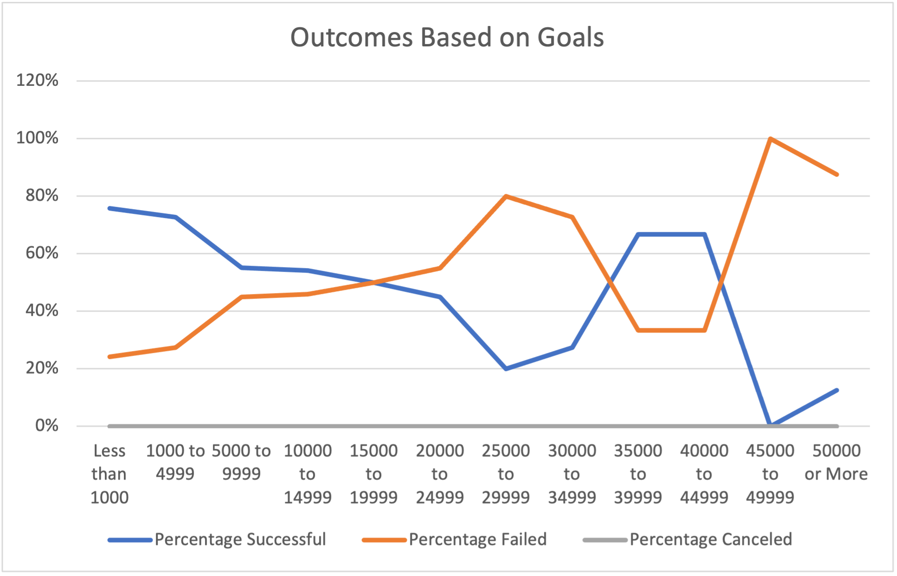
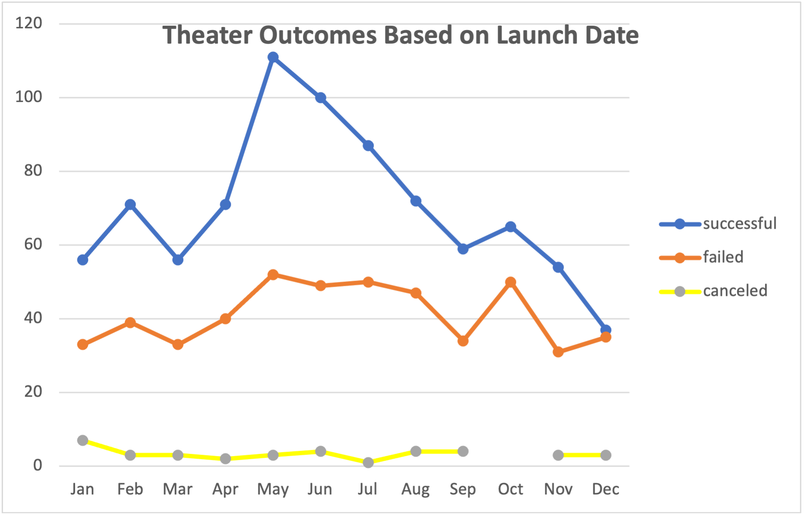

# Kickstarting with Excel

## Overview of Project
The purpose of this analysis is to compare the kickstarter results of *Fever* with other kickstarters. 
### Purpose
The two analyses each compare the outcomes of the kickstarters with their fundraising goals and when they launched.
## Analysis and Challenges

# The Analysis
**The First Analysis**

To determine how outcomes varied based on their launch date, first a *Years* column in the dataset by using 'YEAR()'. This will aid in creating a pivot table for the dataset allowing us to filter by Year. To create the pivot table, *Outcomes* were used for the columns and values, *Date Created Conversion* for the rows, and *Parent Category* and *Years* for the filters in order to only get results from  the *Theater* category. Once column labels are filtered correctly, a line can be created to visualize the relationship between outcomes and launch date.

**The Second Analysis**

To determine how outcomes varied based on goal amount, a new data table must be produced. In this new data table, twelve dollar-amount ranges were used to populate the data. Then, to calculate each category: *Number Successful*, *Number Failed* and *Number Canceled*, the 'COUNTIFS()' function was used. A sum of the total projects for each dollar-amount range was calculated using 'SUM()'. Using this current dataset, a percentage of each outcome was created to populate: *Percentage Successful*, *Percentage Failed*, and *Percentage Canceled*. To visualize the data, a line chart was created to demonstrate the outcomes given varying dollar-amount ranges.

# The Challenges

The first challenge was on the first analysis when trying to populate the months in the rows of the pivot table. To overcome this, *Years* and *Quarters* needed to be filtered out of the pivot table. 

The second challenge was creating the line chart for the second analysis. Given the format of the dataset, the x and y-axis needed to be reversed after creation in order for the data to reflect correctly. In addition, the *Goals* heading needed to be manually omitted from the line chart. 

### Analysis of Outcomes Based on Launch Date
The first conclusion that can be made from this analysis is that May is the best month to start a kickstarter campaign. May had the highest number of successes with 111 successful outcomes. Granted, out of the total 166 campaigns that were launched this month, 52 of these campaigns failed which is the highest number of failures amongst all the months. 

The Second conclusion that can be made is that December is the worst month to start a kickstarter campaign. Out of the total 75 campaigns that were launched in December, only 37 were successful and 35 failed. 
### Analysis of Outcomes Based on Goals
This analysis shows that the ideal budget for a kickstarter campaign is when the goal amount is set below 19999 dollars. Although the graph indicated that campaigns with goals between 35000 and 44999 showed a success rate of 67%, campaigns that were less than 19999 had a success rate of 50% or higher. 
### Challenges and Difficulties Encountered
One of the limitations of this dataset is that the total number of projects for both analyses needs to be taken into consideration. For the first analysis, there are more kickstarters in the spring/summer months than there are in the fall/winter. For the second analysis, there are a lot more projects that had a goal of less than 9999 dollars than there were with goals of 10000 or more. This suggests that the data may be skewed and further analysis of the data must be done in order to visualize the dataset properly.
### Recommendations
A good starting point that would help with the main limitation of this dataset is creating a few visualizations that would help indicate where the focal point is, mainly the mean, median and mode. A bar graph can be created for both analyses to visualize what the mean number of projects created versus both goal amount in dollars and launch date. 

Furthermore, if we wanted to detect any outliers in the data, a box and whisker plot can be used. This graph would be most helpful for the second analysis as the data seems to be skewed toward the lesser dollar amount ranges. 
## Results
The Kickstarter Analysis shows that in order to create a successful campaign, it is recommended that it launches in May and has a goal set of 20,000 dollars or less. More data is needed to see if campaigns that are more than 20,000 dollars can be successful, but we can say with certainty that a campaign is more likely to succeed when the goal amount is on the low end. 
